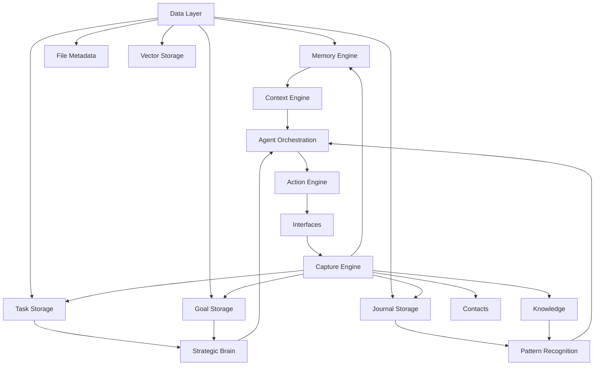

# ATLAS Core Architecture Specification

Date: 2026-06-11

## Mission

Design ATLAS as a Personal Operating System.

Do not design ATLAS as a chatbot.
Do not design ATLAS as a dashboard.
The dashboard is only an interface.
The memory system is the product.

## Canonical Principle

ATLAS Core owns:

- Memory
- Context
- Tasks
- Projects
- Goals
- Contacts
- Knowledge
- Journal Entries
- Reasoning
- Actions

Every interface must communicate through ATLAS Core.
No interface may store primary data.

## Architecture Layers

### Layer 1: ATLAS Core

Responsibilities:

- Memory Engine
- Context Engine
- Strategic Brain
- Reasoning Engine
- Agent Orchestration

This is the source of truth.

ATLAS Core must:

- accept canonical objects
- resolve relationships
- store current state
- produce recommendations
- route actions to approved tools
- preserve audit history

### Layer 2: Data Layer

Responsibilities:

- Database
- Vector Storage
- Task Storage
- Journal Storage
- Goal Storage
- File Metadata

Requirements:

- Persistent
- Searchable
- Backed Up
- Portable

The data layer stores the canonical objects that ATLAS Core reads and writes.

### Layer 3: Capture Engine

Responsibilities:

Receive input from:

- Text
- Voice
- Telegram
- Discord
- Email
- Mobile App
- Dashboard

Every input becomes one or more of:

- Memory
- Task
- Goal
- Journal
- Knowledge
- Contact

Every capture event must be automatically categorized and linked to existing objects when possible.

### Layer 4: Action Engine

Responsibilities:

- Tool Use
- File Operations
- Calendar
- Email
- Browser
- Search
- Automation

All actions logged.

All risky actions approval gated.

### Layer 5: Intelligence Modules

Modules:

- Strategic Advisor
- Pattern Recognition
- Daily Debrief Analysis
- Project Advisor
- Business Advisor

Purpose:

Turn memory into decisions.

### Layer 6: Interfaces

Interfaces:

- Dashboard
- Mobile
- Discord
- Telegram
- Voice
- EchoFrame

Rules:

- Interfaces are replaceable.
- Interfaces never own data.
- Interfaces only display and capture.

## Universal Objects

Everything in ATLAS must inherit from:

- Task
- Project
- Goal
- Memory
- Contact
- Knowledge
- Journal

Each object must be able to link to other objects.

## Current Architecture Position

The repository already contains pieces of the future system:

- local shared data storage
- agent routing
- approval gating
- action logging
- local dashboard shells
- memory helpers
- file and connector planning helpers
- local Discord and assistant scripts

The first executable version of ATLAS Core should not replace this structure blindly.
It should unify it.

## Design Rules

1. ATLAS Core is the authority.
2. Interfaces are windows.
3. Capture is universal.
4. Actions are logged.
5. Memory is permanent.
6. Approval is required for risky external action.
7. Every object must be searchable.
8. Every object must be linkable.
9. Every object must be portable.
10. Every object must survive interface changes.

## Recommended Core Boundary

ATLAS Core should own:

- canonical object schemas
- relationship resolution
- search and retrieval
- categorization
- priority ranking
- reasoning summaries
- action requests
- audit records

ATLAS Interfaces should own:

- input presentation
- output presentation
- local interaction state only
- temporary draft state only

## Dependency Graph

## First Executable Version

The first executable version of ATLAS Core should be:

- persistent
- searchable
- approval gated
- interface agnostic
- memory first

The first concrete deliverable after this specification is:

- ATLAS Memory Engine v1
