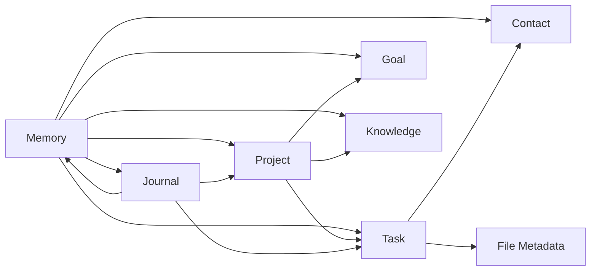

# ATLAS Object Relationships

Date: 2026-06-11

## Purpose

This document defines how ATLAS objects connect to each other so the system can reason, retrieve, and act without losing context.

## Core Relationship Rule

Every object should be linkable.
Every important action should leave a trail.
Every trail should point back to memory, tasks, projects, goals, contacts, knowledge, or journal entries.

## Relationship Map

### Task

- belongs to one `Project`
- may support one or more `Goal`
- may be created from `Memory`
- may reference one or more `Contact`
- may attach files through `File Metadata`

### Project

- contains many `Task`
- may roll up to one or more `Goal`
- may be influenced by `Memory`
- may reference many `Contact`
- may reference many `Knowledge` items

### Goal

- may be supported by many `Project`
- may be broken into many `Task`
- may be informed by `Memory`
- may be reviewed in `Journal`

### Memory

- may link to many `Task`
- may link to many `Project`
- may link to many `Goal`
- may link to many `Contact`
- may link to many `Knowledge`
- may link to many `Journal`

### Contact

- may be referenced by many `Task`
- may be referenced by many `Project`
- may be remembered in many `Memory` items
- may be referenced in many `Journal` entries

### Knowledge

- may support many `Memory` items
- may support many `Task`
- may support many `Project`
- may be cited in many `Journal` entries

### Journal

- may mention many `Task`
- may mention many `Project`
- may mention many `Goal`
- may mention many `Memory`
- may mention many `Contact`
- may mention many `Knowledge`

## Relationship Types

- `belongsTo`
- `contains`
- `supports`
- `blocks`
- `derivedFrom`
- `references`
- `reminds`
- `followsUpOn`
- `captures`
- `summarizes`
- `confirms`

## Relationship Priority Rules

When multiple links exist, ATLAS Core should prefer:

1. direct links
2. explicit user-created links
3. recent links
4. high-confidence memory links
5. derived links from capture or reasoning

## Example Relationship Chains

### Capture to Action

```text
Voice note
  -> Capture Event
  -> Memory
  -> Task
  -> Project
  -> Follow-up action
```

### Journal to Strategy

```text
Nightly Debrief
  -> Journal
  -> Memory update
  -> Pattern Recognition
  -> Strategic Advisor
  -> Next-day priorities
```

### Meeting to Follow-up

```text
Meeting note
  -> Memory
  -> Contact
  -> Task
  -> Project
  -> Reminder
```

## Recommended Graph View



## Query Expectations

ATLAS Core should be able to answer:

- What tasks relate to this project?
- What memory supports this decision?
- Which contacts are involved?
- Which goals are blocked?
- What did the last debrief say?
- What knowledge supports this task?
- Which files belong to this project?

## Relationship Integrity Rules

1. No object should exist in isolation unless it is explicitly uncategorized.
2. Every important object should have at least one relationship.
3. A relationship should always have a clear direction.
4. Relationships should be searchable.
5. Relationships should be auditable.
6. Derived links should never overwrite canonical links.

