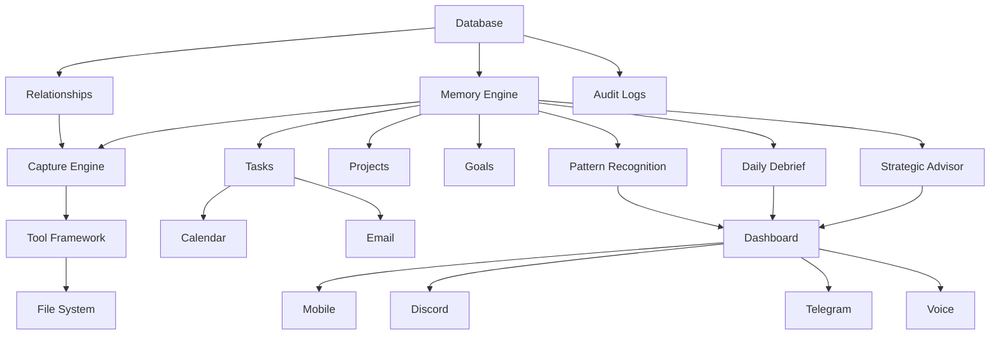

# ATLAS Phase 1 Build Order

Date: 2026-06-11

## Build Goal

Build the first executable ATLAS Core foundation in a strict order so the system becomes reliable before it becomes flashy.

## Phase 1 Build Order

### 1. Database

Why first:

- every other layer needs persistent state
- no interface should own primary data

Deliverable:

- a durable storage abstraction for objects, relationships, and audit logs

Acceptance:

- data survives restart
- records are searchable
- records can be linked

### 2. Memory Engine

Why second:

- memory is the product
- ATLAS Core needs a durable context spine

Deliverable:

- save memory
- retrieve memory
- search memory
- link memory to projects, tasks, and contacts
- store journal entries

Acceptance:

- memory can be written and read reliably
- memory can be queried from other layers

### 3. Capture Engine

Why third:

- ATLAS must accept input from multiple interfaces
- capture is the intake funnel for everything else

Deliverable:

- text capture
- voice capture
- Discord capture
- email capture
- mobile capture
- dashboard capture

Acceptance:

- a single input can create memory, task, goal, journal, knowledge, or contact records

### 4. Tool Framework

Why fourth:

- actions need a single approval-gated execution layer

Deliverable:

- tool registry
- permission checks
- action logging
- tool execution adapters

Acceptance:

- tools can be called through one safe path
- risky actions are blocked or approved

### 5. File System

Why fifth:

- ATLAS must be able to work with files safely and predictably

Deliverable:

- read
- write
- rename
- move
- delete
- metadata tracking

Acceptance:

- every file action is logged
- risky file actions require approval

## Phase 2 Build Order

### 6. Tasks
### 7. Projects
### 8. Goals
### 9. Calendar
### 10. Email

Goal for Phase 2:

- turn memory into day-to-day productivity

## Phase 3 Build Order

### 11. Strategic Advisor
### 12. Daily Debrief
### 13. Pattern Recognition

Goal for Phase 3:

- turn memory into decisions

## Phase 4 Build Order

### 14. Dashboard
### 15. Mobile
### 16. Discord
### 17. Telegram
### 18. Voice

Goal for Phase 4:

- expose ATLAS Core through replaceable interfaces

## Dependency Graph

## First Executable Version

The first executable version of ATLAS should focus on:

- persistent storage
- memory save/retrieve/search
- object linking
- capture routing
- tool permissions
- file metadata

Not on:

- polished dashboard experiences
- voice
- external growth features
- smart glasses

## Phase 1 Exit Criteria

Phase 1 is ready when:

- database persists reliably
- memory works reliably
- capture routes input correctly
- tool framework is approval gated
- file actions are logged
- tasks, projects, and goals can be linked
- the system can be demoed as a real operating core
